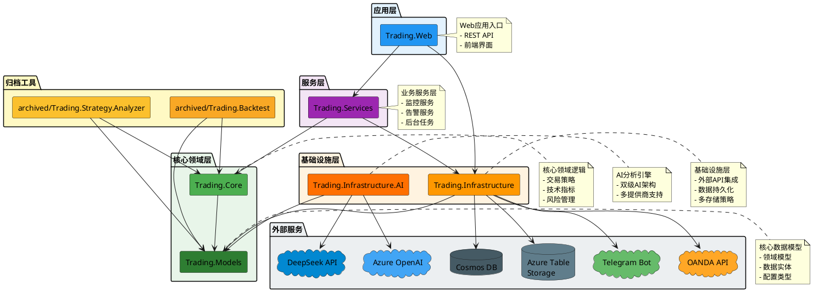
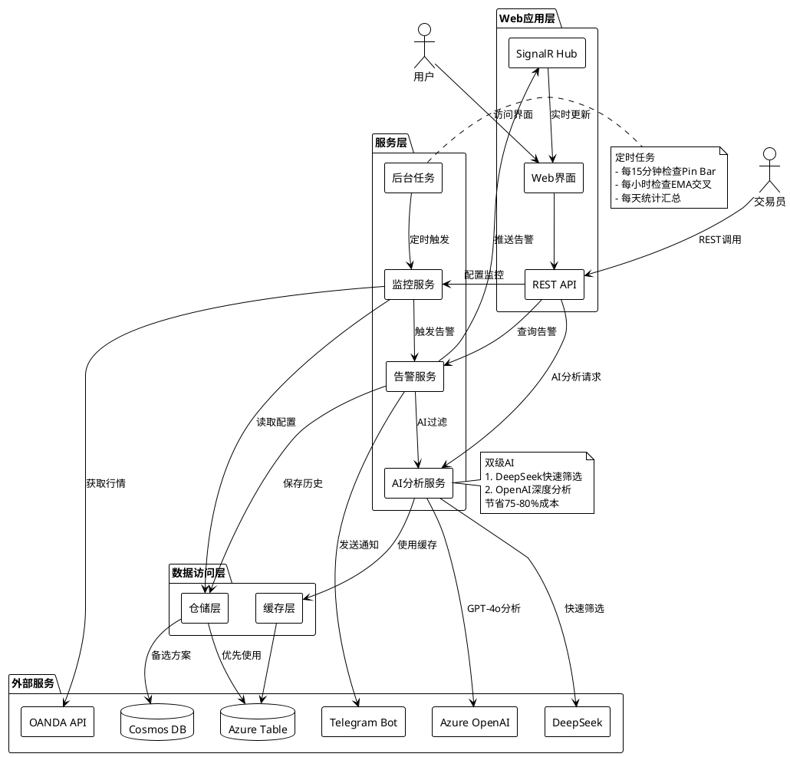
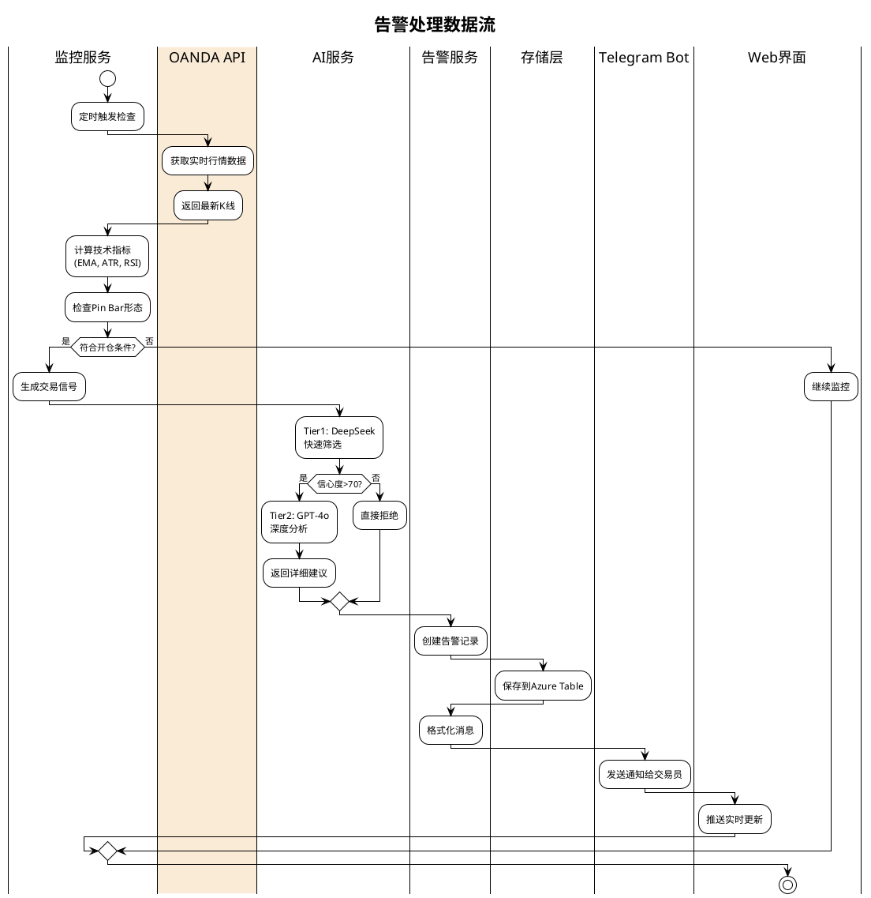

# 智能交易系统

基于.NET 8的智能交易系统，整合AI分析、实时监控、回测引擎等功能。

## 项目结构

```
TradingSystem/
├── src/
│   ├── Trading.Models/                    # 核心数据模型
│   │   └── Models/                         # 数据模型（Candle、Trade等）
│   ├── Trading.Core/                      # 核心交易逻辑
│   │   ├── Strategies/                     # 交易策略（Pin Bar等）
│   │   ├── Indicators/                     # 技术指标
│   │   └── RiskManagement/                 # 风险管理（仓位计算）
│   ├── Trading.Infrastructure/            # 基础设施层
│   │   ├── AI/                             # AI分析服务（Azure OpenAI/DeepSeek）
│   │   ├── CosmosDB/                       # Cosmos DB实现
│   │   ├── AzureTable/                     # Azure Table Storage实现
│   │   ├── Telegram/                       # Telegram Bot集成
│   │   └── Email/                          # 邮件服务
│   ├── Trading.Services/                  # 业务服务层
│   │   ├── Services/                       # 业务服务（监控、告警）
│   │   └── BackgroundJobs/                 # 后台任务
│   └── Trading.Web/                       # Web应用
│       ├── Controllers/                    # REST API
│       └── wwwroot/                        # 前端界面
├── archived/                              # 已归档的回测和分析工具
│   ├── TradingBacktest.sln                 # 回测系统独立解决方案
│   ├── Trading.Backtest.Data/              # 回测数据基础设施
│   ├── Trading.Backtest/                   # 回测引擎
│   ├── Trading.Backtest.Console/           # Console回测工具
│   ├── Trading.Backtest.Web/               # Web回测界面
│   ├── Trading.Backtest.ParameterOptimizer/ # 参数优化器
│   └── Trading.Strategy.Analyzer/          # 策略分析器
├── data/                                   # CSV历史数据
├── docs/                                   # 文档
│   ├── setup/                              # 配置指南
│   ├── guides/                             # 使用指南
│   ├── strategies/                         # 策略文档
│   └── maintenance/                        # 维护文档
├── TradingSystem.sln                       # 主系统解决方案
└── README.md                               # 本文档
```

## 架构设计

### 项目依赖关系



### 分层架构说明

| 层级 | 项目 | 职责 | 依赖 |
|------|------|------|------|
| **应用层** | Trading.Web | Web应用、REST API、前端界面 | Services, Infrastructure |
| **服务层** | Trading.Services | 业务服务、监控告警、后台任务 | Infrastructure, Core |
| **基础设施层** | Trading.Infrastructure | 外部服务集成、数据持久化、AI服务 | Models |
| | Trading.Infrastructure.AI | AI分析服务、双级决策引擎 | Models |
| **核心领域层** | Trading.Core | 交易策略、技术指标、风险管理 | Models |
| | Trading.Models | 核心数据模型、领域实体 | 无 |
| **归档工具** | archived/Trading.Backtest | 回测引擎、参数优化 | Core, Models |
| | archived/Trading.Strategy.Analyzer | 策略分析、数据处理 | Core, Models |

### 核心设计原则

1. **依赖倒置**：上层依赖抽象，下层实现接口
2. **单一职责**：每个项目职责清晰，边界明确
3. **开闭原则**：易于扩展新策略、新指标、新存储
4. **模型分离**：Trading.Models集中定义所有核心数据模型
5. **分层清晰**：严格遵守分层架构，避免跨层调用
6. **基础设施整合**：Trading.Infrastructure统一管理所有外部依赖（数据库、API、AI）

### 运行时架构



### 数据流图



## 核心功能

### 1. AI智能分析
- ✅ **双级AI架构**：成本优化的Tier1快速筛选 + Tier2深度分析
- ✅ **多AI提供商支持**：Azure OpenAI (GPT-4o)、DeepSeek
- ✅ **成本控制**：相比单一GPT-4o模型节省75-80%成本
- ✅ **智能信号过滤**：自动筛选高质量交易信号

### 2. 实时监控告警
- ✅ **价格监控**：固定价格、EMA交叉、MA交叉监控
- ✅ **Pin Bar形态监控**：自动检测Pin Bar交易信号
- ✅ **多渠道通知**：Telegram Bot推送、邮件通知
- ✅ **告警历史记录**：Azure Table Storage/Cosmos DB持久化

### 3. 风险管理
- ✅ **智能仓位计算**：基于账户权益和风险百分比自动计算
- ✅ **Prop Firm规则支持**：预设Blue Guardian、FTMO等规则
- ✅ **单日风险控制**：自动追踪和限制单日亏损
- ✅ **多品种支持**：黄金、白银、外汇等多种交易品种

### 4. 数据持久化
- ✅ **Azure Table Storage**：低成本NoSQL存储（$1-3/月）
- ✅ **Cosmos DB**：高性能数据库（可选）
- ✅ **内存存储**：移动端/开发环境自动降级
- ✅ **灵活配置**：支持混合存储模式

### 5. 回测系统（已归档）
- ✅ Pin Bar策略回测引擎
- ✅ 参数优化器（网格搜索）
- ✅ 完整的统计报告
- 📦 已迁移至 `archived/` 目录

## 快速开始

### 前置要求

- .NET 8.0 SDK 或更高版本
- Azure Table Storage或Cosmos DB（可选，不配置时自动使用内存存储）
- Telegram Bot Token（用于告警通知）
- OANDA API账户（用于实时数据）

### 1. 克隆并配置

```bash
git clone <repository-url>
cd richdad
```

### 2. 配置User Secrets（推荐）

```bash
cd src/Trading.Infras.Web
dotnet user-secrets init
dotnet user-secrets set "Telegram:BotToken" "YOUR_BOT_TOKEN"
dotnet user-secrets set "Telegram:DefaultChatId" "YOUR_CHAT_ID"
dotnet user-secrets set "Oanda:ApiKey" "YOUR_OANDA_API_KEY"
dotnet user-secrets set "Oanda:AccountId" "YOUR_ACCOUNT_ID"
```

详细配置说明参见：[docs/setup/USER_SECRETS_SETUP.md](docs/setup/USER_SECRETS_SETUP.md)

### 3. 运行Web应用

```bash
cd src/Trading.Infras.Web
dotnet run
```

访问：`http://localhost:5000`

### 4. 主要功能页面

- **价格监控配置**：`http://localhost:5000/`
- **Pin Bar监控**：`http://localhost:5000/pinbar-config.html`
- **告警历史**：通过API查询
- **AI分析**：自动运行

## 文档导航

### 配置指南
- [用户密钥配置](docs/setup/USER_SECRETS_SETUP.md) - 安全配置敏感信息
- [Azure OpenAI配置](docs/setup/AZURE_OPENAI_SETUP.md) - GPT-4o配置
- [DeepSeek集成](docs/setup/DEEPSEEK_INTEGRATION_GUIDE.md) - DeepSeek API配置
- [Azure Table Storage配置](docs/setup/AZURE_TABLE_STORAGE_GUIDE.md) - 低成本存储
- [邮件配置](docs/setup/EMAIL_SETUP.md) - 邮件通知设置

### 使用指南
- [告警系统快速入门](docs/ALERT_SYSTEM_QUICKSTART.md) - 价格监控和告警
- [Pin Bar监控快速入门](docs/PINBAR_QUICKSTART.md) - Pin Bar形态监控
- [双级AI快速入门](docs/DUAL_TIER_AI_QUICKSTART.md) - AI智能分析
- [仓位计算器](docs/guides/POSITION_CALCULATOR.md) - 智能仓位管理
- [移动端部署](docs/guides/MOBILE_DEPLOYMENT.md) - 无数据库运行模式

### 开发工具
- [测试脚本](scripts/) - 各类测试和验证脚本
  - `test-deepseek.sh/ps1` - DeepSeek集成测试
  - `test-deepseek-integration.ps1` - DeepSeek集成验证
  - `verify-issue4-complete.sh` - Issue 4完成验证
  - `update-namespaces.ps1` - 命名空间更新工具

### 策略文档
- [Pin Bar策略](docs/strategies/pin-bar.strategy.md) - Pin Bar交易策略详解

### 项目管理
- [GitHub Issues](GITHUB_ISSUES.md) - 所有功能需求和实现记录
- [Issues目录](docs/issues/) - 按状态组织的Issue文档

## 技术栈

- **.NET 8.0** - 核心框架
- **Azure OpenAI / DeepSeek** - AI分析服务
- **Azure Table Storage / Cosmos DB** - 数据持久化
- **OANDA API** - 实时市场数据
- **Telegram Bot API** - 告警通知
- **TA-Lib** - 技术指标计算
- **Hangfire** - 后台任务调度（可选）

## 成本优化

| 服务 | 月度成本 | 说明 |
|------|---------|------|
| Azure Table Storage | $1-3 | 推荐的低成本存储 |
| DeepSeek AI | ~$20 | 双级AI架构主力模型 |
| Azure OpenAI | ~$10-15 | 仅用于高质量信号分析 |
| Telegram Bot | 免费 | 推送通知 |
| OANDA API | 免费 | 实时数据（demo账户） |
| **总计** | **~$30-40/月** | vs. 纯GPT-4o: $150+/月 |

## 贡献指南

欢迎提交Issue和Pull Request！

1. Fork本仓库
2. 创建特性分支 (`git checkout -b feature/AmazingFeature`)
3. 提交更改 (`git commit -m 'Add some AmazingFeature'`)
4. 推送到分支 (`git push origin feature/AmazingFeature`)
5. 开启Pull Request

## 许可证

MIT License

## 联系方式

如有问题或建议，请提Issue。
